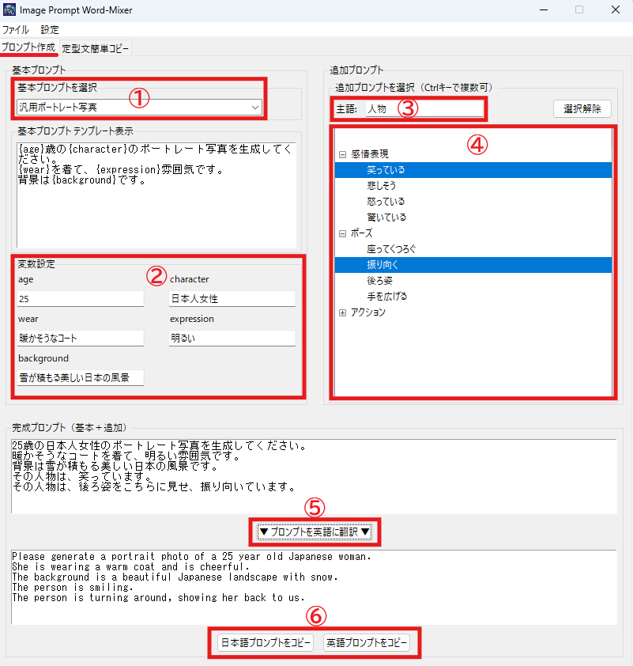
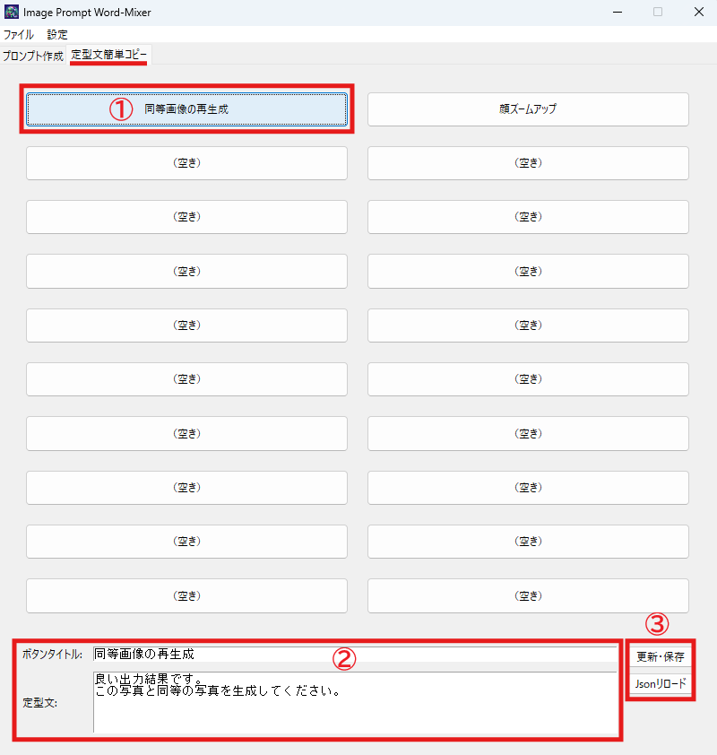

# Image Prompt Word-Mixer

**Image Prompt Word-Mixer** は、画像生成に用いるプロンプトのワードを自由に組み替えることで、さまざまなパターンの画像作成を支援するデスクトップアプリケーションです。  

本アプリケーションは、Gemini や Microsoft Copilot のような画像生成機能を持つ対話型AIツールと組み合わせて利用することを想定しています。  

対話型AIツールによる画像生成では、従来の画像生成AIツールのように大量のプロンプトを入力しても、期待通りの画像が得られなかったり、フィルタにより生成が制限されることがしばしばあります。そこで、まずはシンプルで短いプロンプトによりベースとなる画像を作成し、その画像に対して対話を重ねながら目的の画像に仕上げることが重要です。  

Image Prompt Word-Mixer では、基本的でシンプルなプロンプトの多彩なバリエーションを作成でき、さらに対話時に品質向上や特徴づけのための定型文を管理し、迅速にコピーすることが可能です。このツールによって、今までにない画像生成体験をお楽しみいただけます🐢

<div align="center">
  
  <p>Image Prompt Word-Mixer の画面</p>
  <p>▼</p>
  
  
  <p>さまざまな生成 AI ツールで利用可能です！</p>
</div>

## 使い方

### 1. 環境設定

- Python 3.x がインストールされていることを確認してください。
- 依存パッケージとして [requests](https://pypi.org/project/requests/) を利用しているため、以下のコマンドでインストールしてください。  
  ※なお、ホスト環境にインストールすることが気になる方は、適宜venv(Python仮想環境など)を利用してください。

  ```sh
  pip install requests
  ```

### 2. 起動方法

- プロジェクトルートディレクトリに移動し、以下のコマンドでアプリケーションを起動してください。

  ```sh
  python app.py
  ```
- [app.py](app.py) をエントリーポイントとして、GUI ウィンドウが表示されます。

### 3. GUI の操作

#### プロンプト作成タブ画面

<div align="center">
  
  <p>プロンプト作成タブの画面</p>
</div>

- **基本プロンプト**  
  基本となるプロンプトを作成します。  
  ① 画面左側の「基本プロンプトを選択」から、使用したいテンプレートを選択します。  
  ② テンプレートが中央のテキストエリアに表示されます。テンプレート内の `{変数名}` を自由に編集して、プロンプトをカスタマイズできます。  
  変数に対応する入力欄も表示されるので、こちらを編集することでも変数を変更できます。

- **追加プロンプト**  
  基本プロンプトに、追加の要素を加えて画像のバリエーションを増やします。  
  ③ 画面右上の「主語」欄に、画像に登場させたい人物やオブジェクトを入力します（例: 女性、猫など）。  
  ④ ツリービューから追加したい要素を選択します。複数選択も可能です。選択した要素が完成プロンプトに追加されます。

- **完成プロンプト**  
  基本プロンプトと追加プロンプトが結合され、画面下部のテキストエリアに最終的なプロンプトが表示されます。

- **プロンプト英語翻訳（任意）**  
  生成された日本語のプロンプトを `DeePL API` を利用して英訳できます。画面上部の設定メニューの「APIキー設定」から、API キーを設定するか、api_key.json ファイルに直接記述することで利用できます。

  - **API キーの取得**  
    `DeePL API` を利用するためには API キーが必要です。API キーは DeePL の公式サイト  
    [https://www.deepl.com/ja/pro-api](https://www.deepl.com/ja/pro-api)  
    で取得してください。なお、API 利用には、ユーザー登録、住所登録、クレジットカード登録が必要です。 
    
  英語翻訳機能を利用しない場合は、この項目はスキップしてください。  
  ⑤ 「▼ プロンプトを英語に翻訳 ▼」ボタンを押すと、プロンプトが翻訳されます。

- **プロンプトのコピー**  
  ⑥ 完成したプロンプトは「コピーボタン」を押すことで、クリップボードにコピーできます。確認ダイアログは表示されず、すぐに利用可能です。

#### 定型文簡単コピータブ画面

<div align="center">
  
  <p>定型文簡単コピータブの画面</p>
</div>

- **定型文の簡単コピー**  
  ① コピーボタンを押すと、あらかじめ設定したプロンプトを、ボタンを押すだけで素早くクリップボードにコピーできます。
- **定型文の確認・編集**  
  ② ボタンを押したタイミングでコピーが完了します。基本的には①の操作のみで問題ありませんが、この項目ではボタンのタイトルや定型文を確認・編集できます。
- **設定の更新・保存**  
  ③ 「更新・保存」ボタンを押すと、②で編集した内容が保存されます。「Jsonリロード」ボタンを押すと、設定ファイルの内容が画面に反映されます。

### 4. JSON ファイルの編集方法

このソフトウェアでは、プロンプトのテンプレートは JSON 形式で管理されています。利用するテンプレート用 JSON ファイルは以下の 2 種類です。

#### 基本プロンプト (basic_prompts.json)

基本プロンプトは生成する画像のベースとなるテンプレート情報を含み、テンプレートと変数の初期値が定義されています。

ファイル例:

```json
[
  {
    "name": "人物がものを持っている",
    "prompt": "{character}が{goods}を持っている写真を生成してください。\n{goods}は、{state}です。",
    "default_variables": {
      "character": "中年男性",
      "goods": "マグカップ",
      "state": "ユニーク"
    }
  },
  {
    "name": "背景をバックにポーズを取る",
    "prompt": "{character}が{background}を背景にポーズをとっている写真を生成してください。",
    "default_variables": {
      "character": "アメリカ人女性",
      "background": "美しい夕焼け"
    }
  }
]
```

各オブジェクトは以下のキーを持ちます:

- **name**  
  プロンプトの名称です。GUI 上ではこの名前が表示され、ユーザーがテンプレートを識別するために利用されます。

- **prompt**  
  画像生成に用いられる説明テンプレートです。中に含まれる `{character}` などのプレースホルダーは、実行時に `default_variables` の値やユーザーの入力で置換されます。

- **default_variables**  
  テンプレート内に含まれる各プレースホルダーの初期値を定義します。ユーザーはこの初期値を編集して、最終的なプロンプトを生成できます。

#### 追加プロンプト (element_prompts.json)

追加プロンプトは基本プロンプトに追加するオプション文章を管理します。

ファイル例:

```json
{
    "default_subject": "人物",
    "categories": [
        {
            "category": "感情表現",
            "prompt_lists": [
                {"title": "笑っている", "prompt": "その{character}は、笑っています。"},
                {"title": "悲しそう", "prompt": "その{character}は、悲しそうです。"},
                {"title": "怒っている", "prompt": "その{character}は、怒っています。"},
                {"title": "驚いている", "prompt": "その{character}は、驚いています。"}
            ]
        },
        {
            "category": "アクション",
            "prompt_lists": [
                {"title": "走っている", "prompt": "その{character}は、素早く走っている。"},
                {"title": "ジャンプしている", "prompt": "その{character}は、ジャンプしています。"},
                {"title": "クライミング", "prompt": "その{character}は、壁を登っています。"},
                {"title": "飛んでいる", "prompt": "その{character}は、空を飛んでいます。"}
            ]
        }
    ]
}
```

各オブジェクトは以下のキーを持ちます:

- **default_subject**
  主語のデフォルト値を定義します。GUI 上の「主語」テキストボックスの初期値として利用されます。

- **categories**  
  追加プロンプトのカテゴリを定義するリストです。

  各カテゴリは以下のキーを持ちます:

  - **category**  
    追加プロンプトを分類するためのカテゴリ名です。GUI 上でグループ分けに利用されます。

  - **prompt_lists**  
    各カテゴリ内で定義された追加プロンプトのリストです。

    各要素は以下のキーを持ちます:

    - **title**  
      プロンプトの名称です。GUI 上ではツリービューの各項目として表示され、ユーザーが内容を識別する際に利用されます。

    - **prompt**  
      実際に画像生成に用いられる説明テンプレートです。テンプレート内に含まれる `{character}` のプレースホルダーは、実行時に「主語」テキストボックスに指定された文字列に置換されます。

#### ワンクリックプロンプト (one_click.json)

定型文簡単コピータブで使用する定型文を管理します。

ファイル例:

```json
[
    {
        "title": "同等画像の再生成",
        "text": "良い出力結果です。\nこの写真と同等の写真を生成してください。"
    },
    {
        "title": "顔ズームアップ",
        "text": "もう少し顔をアップにしたポートレート写真にしてください。"
    },
    {
        "title": "（空き）",
        "text": ""
    }
]
```

各オブジェクトは以下のキーを持ちます:

- **title**  
  ボタンの名称です。GUI 上ではボタンのラベルとして表示されます。

- **text**  
  コピーされる定型文テキストです。ボタンを押すと、このテキストがクリップボードにコピーされます。


## exeファイルの作成

Python のスクリプトを単体の exe ファイルとして利用する場合は、[PyInstaller](https://pypi.org/project/pyinstaller/) を利用します。  
事前に以下のコマンドで pyinstaller をインストールしてください:

```bash
pip install pyinstaller
```

インストール後、以下のコマンドで exeファイルを作成します:

```bash
pyinstaller --onefile --windowed app.py
```

上記コマンドを実行すると「dist」フォルダに exeファイルが生成されます。  
作成されたexeファイルと同階層に
- basic_prompts.json
- element_prompts.json
- one_click.json
- api_key.json

を配置してください。

## ライセンス

ライセンスファイルを参照してください  
[LICENSE ファイルへ](LICENSE)

## 最後に

もし問題やご要望がありましたら、issue でご連絡ください。


