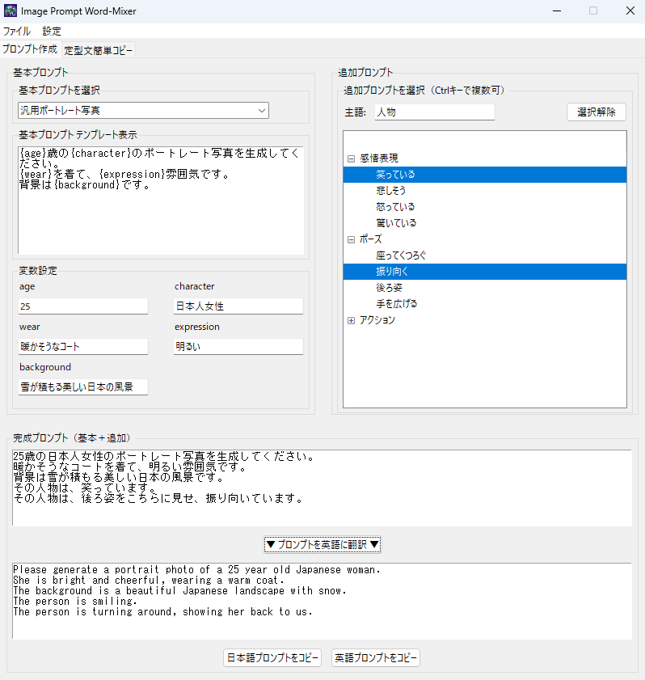

# Image Prompt Word-Mixer 
**Image Prompt Word-Mixer**は、画像生成に使用するプロンプトのワードを自由に組み替えることで、さまざまなパターンの画像作成を支援するデスクトップアプリケーションです。
 
  <div align="center">
    
    <p>Image Prompt Word-Mixerの画面</p>
    <p>▼</p>
    
    
    <p>様々な生成AIツールに利用可能です！</p>
  </div>


## 使い方

1. **環境設定**  
   - Python 3.x がインストールされていることを確認してください。  
   - 依存パッケージとして [requests](https://pypi.org/project/requests/) を利用しているため、以下のコマンドでインストールしてください。  
     ```sh
     pip install requests
     ```  

2. **起動方法**  
   - プロジェクトルートディレクトリに移動し、以下のコマンドでアプリケーションを起動してください。  
     ```sh
     python app.py
     ```  
   - [app.py](app.py) をエントリーポイントとして、GUIウィンドウが表示されます。

3. **GUIの操作**  
   - **基本プロンプト**  
     画面左側では、コンボボックスから基本プロンプトを選択すると、テンプレートと変数入力欄が表示されます。  
     - 例: 「人物がものを持っている」を選択すると、`{character}`, `{goods}`, `{state}` の各変数の初期値が入力欄に表示され、編集可能です。

   - **追加プロンプト**  
     画面右側のTreeviewから、複数の追加プロンプト（感情表現やアクションなど）を選択できます。  
     - 例: 「笑顔」や「走っている」を選択すると、各プロンプトが選択され、内部でプレースホルダ `{character}` が置換されます。

   - **完成プロンプト**  
     基本プロンプトと選択した追加プロンプトが結合され、下部のテキストエリアに最終プロンプトとして表示されます。  
     - `クリップボードにコピー`ボタンを押すと、完成プロンプトがクリップボードに保存されます。

4. **JSONファイルの作成方法**  

   このソフトウェアでは、プロンプトのテンプレートは`JSON形式`で管理されています。利用するテンプレート用JSONファイルは以下の2種類です。

   - **基本プロンプト ([basic_prompts.json](basic_prompts.json))**

     基本プロンプトは生成する画像のベースとなるテンプレート情報を含み、テンプレートと変数の初期値のキー名が変更されています。ファイル例:

     ```json
     [
         {
             "name": "人物がものを持っている",
             "prompt": "{character}が{goods}を持っている写真を生成してください。\n{goods}は、{state}です。",
             "default_variables": {
                 "character": "中年男性",
                 "goods": "マグカップ",
                 "state": "ユニーク"
             }
         },
         {
             "name": "背景をバックにポーズを取る",
             "prompt": "{character}が{background}を背景にポーズをとっている写真を生成してください。",
             "default_variables": {
                 "character": "アメリカ人女性",
                 "background": "美しい夕焼け"
             }
         }
     ]
     ```

     各オブジェクトは以下のキーを持ちます:

     - **name**  
       プロンプトの名称です。GUI上ではこの名前が表示され、ユーザーがテンプレートを識別するために利用されます。

     - **prompt**  
       画像生成に用いられる説明テンプレートです。中に含まれる `{character}` などのプレースホルダは、実行時に `default_variables` の値やユーザーの入力値で置換されます。

     - **default_variables**  
       テンプレート内に含まれる各プレースホルダの初期値を定義します。ユーザーはこの初期値を編集して、最終的なプロンプトを生成できます。

   - **追加プロンプト ([element_prompts.json](element_prompts.json))**

     追加プロンプトは基本プロンプトに追加するオプション文章を管理します。今回、キー名が一部変更され、もともとの `prompts` が `prompt_lists` に、各プロンプトの名称が `name` から `title` に、そして `text` が `prompt` に変更されています。ファイル例:

     ```json
     [
         {
             "category": "感情表現",
             "prompt_lists": [
                 {"title": "笑顔", "prompt": "その{character}は、笑顔です。"},
                 {"title": "悲しい", "prompt": "その{character}は、悲しそうです。"}
             ]
         },
         {
             "category": "アクション",
             "prompt_lists": [
                 {"title": "走っている", "prompt": "その{character}は、素早く走っている。"},
                 {"title": "ジャンプしている", "prompt": "その{character}は、ジャンプしています。"},
                 {"title": "クライミング", "prompt": "その{character}は、壁を登っています。"}
             ]
         }
     ]
     ```

     各カテゴリおよびプロンプトオブジェクトは以下のキーを持ちます：

     - **category**  
       追加プロンプトを分類するためのカテゴリ名です。GUI上でグループ分けに利用されます。

     - **prompt_lists**  
       各カテゴリ内で定義された追加プロンプトのリストです。

       各要素に以下のキーが含まれます:
     
       - **title**  
         プロンプトの名称です。GUI上ではツリービューの各プロンプト項目として表示され、ユーザーが内容を識別する際に利用されます。

       - **prompt**  
         実際に画像生成に用いられる説明テンプレートです。テンプレート内に含まれる `{character}` のプレースホルダは、実行時に`主語`テキストボックスに指定された文字列に置換されます。


## 英訳機能

本機能では、ユーザーが生成した日本語のプロンプトを DeePL API を利用して英訳することができます。  

- **APIキーの取得**  
DeePL API を利用するためには、API キーが必要です。API キーは DeePL の公式サイトで取得できます。  
[https://www.deepl.com/ja/pro-api](https://www.deepl.com/ja/pro-api)  
なお、API利用にあたっては、ユーザー登録、住所登録、クレジットカード登録が必要です。

- **APIキーの設定([api_key.json](api_key.json))**  
DeePL の APIキーを取得したら、`api_key.json`に保存してください。
以下のjsonフォーマットの`your_api_key_her`の部分をDeepLのAPIキーに置き換えてください。

  ```json
  {
      "api_key": "your_api_key_here"
  }
  ```
- **英訳ボタン**  
日本語プロンプトが完成した状態で`▼ プロンプトを英語に翻訳 ▼`ボタンをクリックすると、日本語の完成プロンプトが DeePL API を利用して英訳され、英訳結果が下部のテキスト領域に表示されます。  
なお、日本語プロンプト欄が空欄、もしくはAPIキーが設定されていない場合は、エラーメッセージが表示されます。

- **プロンプトのコピー**  
完成したプロンプトは`コピーボタン`を押すことで、クリップボードにコピーすることができます。特に確認ダイアログなどは表示されませんので、素早く利用することができます。


  


